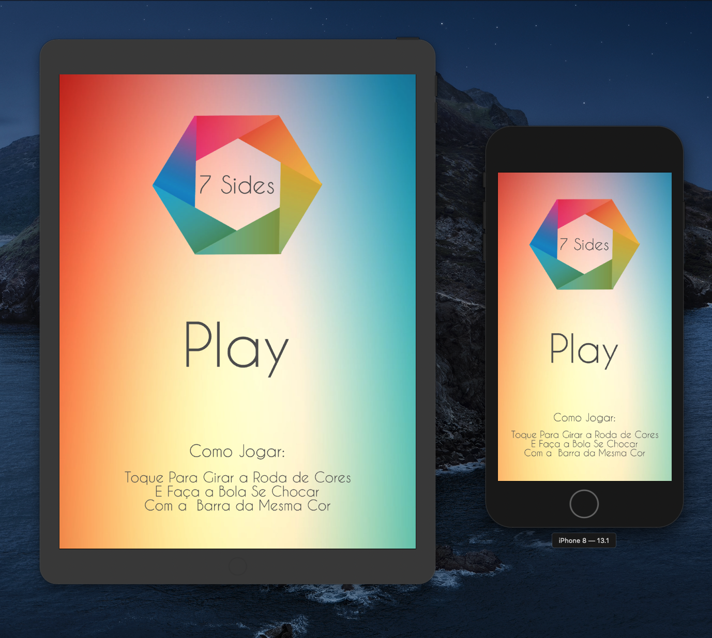
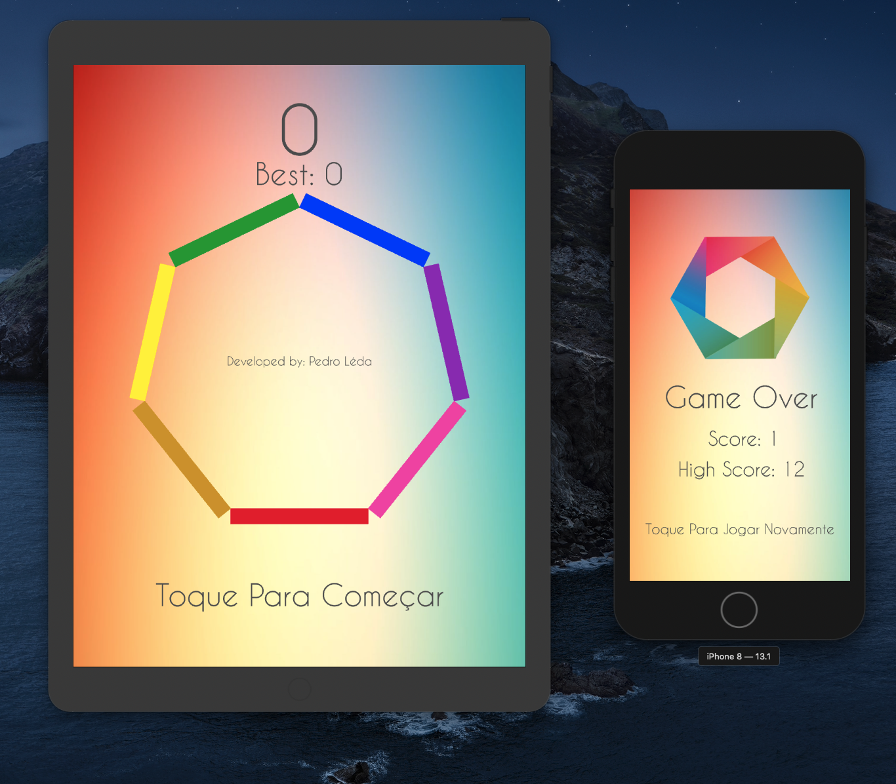

# Seven-Sides

### App Desenvolvido em Swift.

## Funções presentes no App:

### O 7 Sides é um game simples com o objetivo de sincronizar as bolinhas que ficam spawnando do centro da tela de diferentes cores com as cores de cada barra, atraves de touchs na tela para controlar a rotação do conjunto de barras.

### O jogo foi criado com intuito de por em pratica alguns topicos de estudo sobre a linguagem swift, criado com SKScenes no qual a tela inicial foi feita de modo dinâmico e a tela de game feita de modo programatico.

# Capturas de Tela da Aplicação

## Tela Inicial

## Tela do Game

